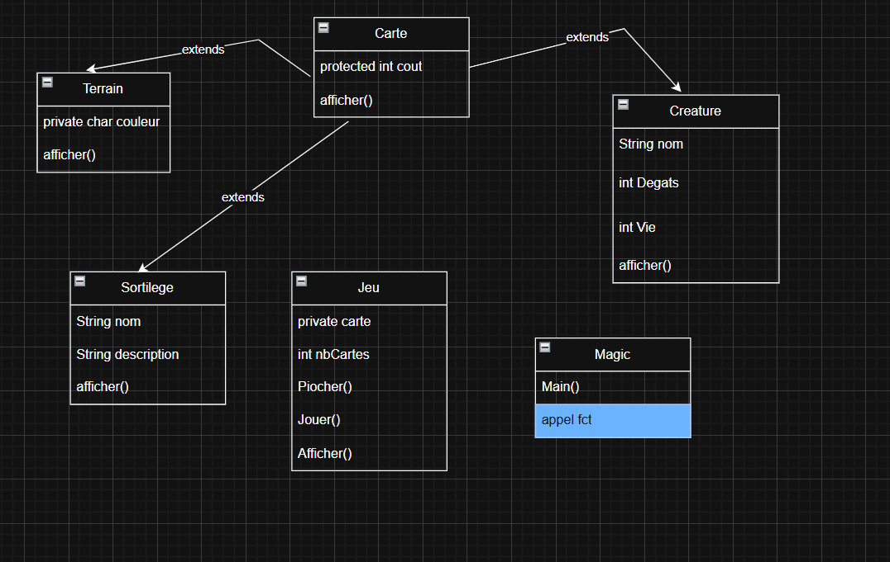
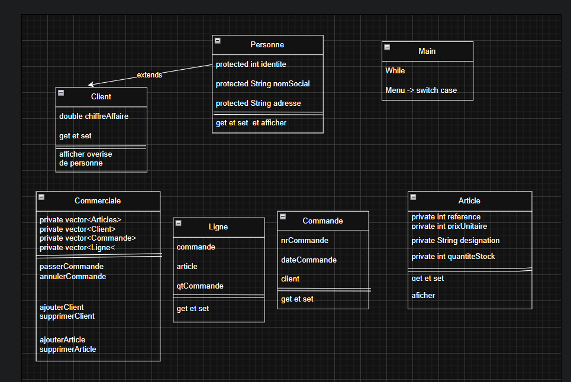

# runtrack.Java
---
## runtrack Java
1. installation JDK
- recupérer windows zip
- le deplaccer dans C
- variables d'environnemnt
- ajouter JAVA_HOME  
  |->chercher JDk-20  
  modifier variables path
- faire edit et ajouter à la suite
Apps;%JAVA_HOME%\bin
- ouvrir bash et vérifier
 ````
java -version
````
2.jetbrain toolsbox
- telecharger appli  
- instal et finish  
- cliquer sur icone  
- faire continuer  
- accepter licence  
- choisir langue  
- choisir theme  
- faire commencer  
- choisir intelIJ community edition  
- faire installer  
- cliquer pour lancer  
- cocher licence  
- faire continuer  
- don'send  
- faire new projcet  
- nommer projet : installation  
- Faire create  
- faire file -> settings  
- Terminal -> Tools -> Terminal
- changer powershell et choisir bash  
- cliquer sur OK 
 ---


creation de fichiers idea  
````declarative
-mkdir -p src
-mkdir -p build
touch src/main.java
````  
## Projet MagiCards  
  
  
---  
## Projet Gestion commerciale
    

**diagramme des class du projet de gestion commerciale**

---  

